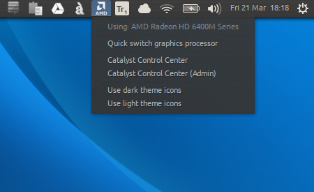

AMD Indicator
=============

**Indicator applet for AMD/Intel switchable graphics**

This indicator applet allows owners of laptops with AMD/Intel hybrid graphics capabilities to
easily switch between the graphics cards without the need of running CCC or terminal commands.



Prerequisites
==============

You have to have a few packages installed to take advantage of this indicator.

**Make sure you have the AMD driver.**

In case the indicator doesn't start because it is missing the **python module "_appindicator_"**, again, make sure to install missing packages.

To install all needed dependencies, for example, you can enter the following command in terminal:

```sudo apt-get install fglrx python-appindicator```

How to install
==============

Make the `setup.sh` file executable and run it using `sudo`, entering the following commands in terminal:

```
chmod a+x setup.sh
sudo ./setup.sh
```
